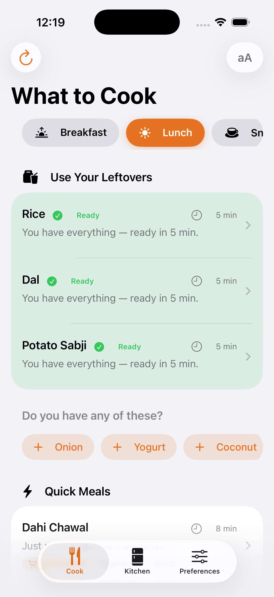
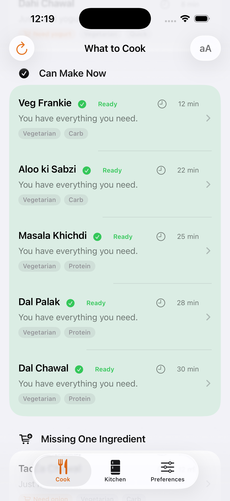
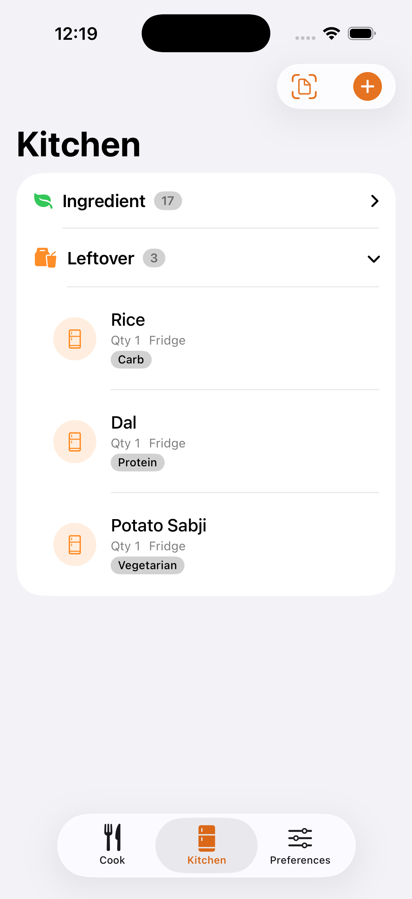
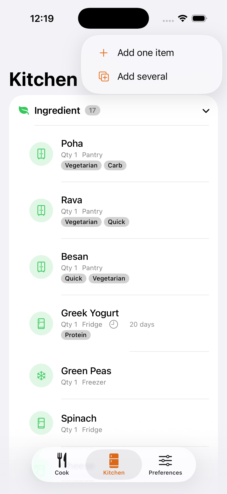
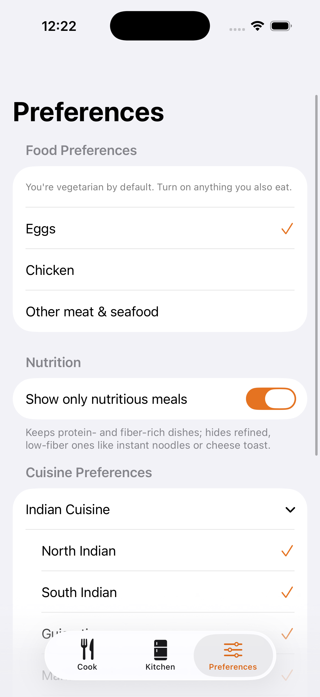
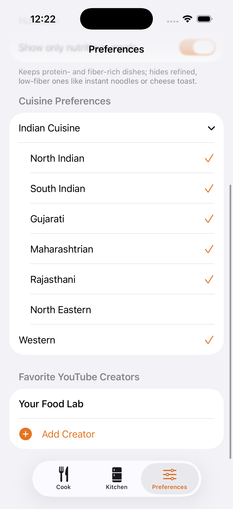

# LeftoverLab

**A privacy-first iOS kitchen assistant that turns what you already have into meals you can actually make.**

LeftoverLab answers one everyday question — *"I have food at home, but I still don't know what to eat."* You add your ingredients, leftovers, and ready-to-cook items, and the app ranks the recipes you can make right now, what you're one ingredient short of, and how to use up food before it expires. Everything runs **on-device**: no account, no backend, and no data leaves your phone. (The only outbound links are optional taps to a recipe creator's YouTube video.)

---

## Why it exists

The real problem isn't a lack of food — it's decision fatigue plus poor visibility into what's already in the kitchen. People own enough to make a meal but default to ordering out, then let food expire. LeftoverLab turns existing inventory into a short list of concrete, makeable meals in seconds, and nudges you to use leftovers and soon-to-expire items first.

---

## Screenshots

| Use Your Leftovers | Ranked Suggestions | Kitchen Inventory |
|:---:|:---:|:---:|
|  |  |  |
| **Add Items** | **Preferences** | **Cuisine & Creators** |
|  |  |  |

---

## Features

- **Smart inventory** — track ingredients, leftovers, and ready-to-cook items, grouped and collapsible, with optional expiration dates.
- **Ranked suggestions** — a deterministic matcher sorts recipes into *Quick*, *Can Make Now*, *Uses Expiring Soon*, and *Missing One Ingredient*, and tells you **why** each was suggested.
- **Leftover intelligence** — cooked leftovers surface in their own section with dish-aware pairing (e.g. dal with rice, sabzi with rice or roti) and a "use the base you already have, otherwise cook a little rice" nudge — only at lunch and dinner.
- **Smart ingredient chips** — surfaces the ingredients that would unlock the most new recipes; tap to add and re-rank instantly.
- **Mealtime + cuisine + diet filters** — auto-selects the current mealtime, with cuisine, diet (vegetarian / egg / chicken / other meat), and nutrition filters.
- **Ingredient normalization** — matches plurals and English/Hindi synonyms, so "curd" finds yogurt recipes and "roti" matches tortilla.
- **Recipe detail + hands-free Cooking Mode** — one large step at a time with spoken narration for cooking without touching the screen.
- **Receipt scanning** — add multiple items at once from a photographed receipt using on-device Vision OCR.
- **Accessibility first** — VoiceOver labels, Dynamic Type, and large tap targets throughout.

---

## Architecture

LeftoverLab uses **SwiftUI + SwiftData** with a small, pure services layer, deliberately separating concerns so the core logic is testable in isolation.

```
        Views (SwiftUI)  ──▶  Services
              ▲                  │
              │                  ├── RecipeMatcher        (pure scoring + classification)
   SwiftData @Model:             ├── RecipeCatalog        (loads bundled recipes.json)
   InventoryItem                 ├── IngredientNormalizer (name matching / synonyms)
              ▲                  └── LeftoverSuggester    (dish-aware leftover pairing)
              │
   recipes.json (bundled, read-only)
```

Key design decisions:

- **Two data lifetimes.** Mutable user data (inventory) lives in SwiftData; the recipe catalog is immutable content loaded from a bundled JSON. They're never conflated.
- **Classification is decoupled from scoring.** Which bucket a recipe lands in is driven by how many required ingredients are missing — not by its score — so a "Can Make Now" label never lies.
- **Coverage as a ratio.** Scoring normalizes by recipe size (`ownedRequired / totalRequired`), so a fully-makeable small recipe beats a half-stocked large one.
- **The matcher is a pure function.** `(inventory, recipes) -> [MealSuggestion]` with no UI or persistence inside it, which makes it fast, explainable, and unit-testable.

---

## Testing

The matching engine is covered by a **Swift Testing** suite (`MatcherTests.swift`) spanning bucket classification, pantry-staple exclusion, plural/synonym normalization, the rice-or-roti base rule, score ordering, expiring-item logic, and the smart-ingredient suggestions. Because the matcher is decoupled from UI and SwiftData, the suite runs in milliseconds and guards against regressions when the ranking logic changes.

Run with `⌘U` in Xcode.

---

## Tech stack

Swift · SwiftUI · SwiftData · Swift Testing · Vision (OCR) · AVFoundation (speech)

## Requirements

- Xcode 26+
- iOS 26+
- iPhone (tested on the iPhone 17 Pro simulator)

## Getting started

1. Clone the repo and open `LeftoverLab.xcodeproj` in Xcode.
2. Make sure `recipes.json` is included in the app target's **Copy Bundle Resources**.
3. Select an iPhone simulator and run (`⌘R`).

---

## Roadmap

- On-device AI recipe generation (Apple Foundation Models) for ingredients the catalog doesn't cover
- App Intents / Siri ("What can I cook right now?")
- Expiration notifications and a waste/savings summary

---

## Note on the recipe catalog

The bundled catalog is a curated set of original recipes, with a focus on Indian home cooking plus some Western dishes. It's intentionally finite and ships with the app so everything works offline.
